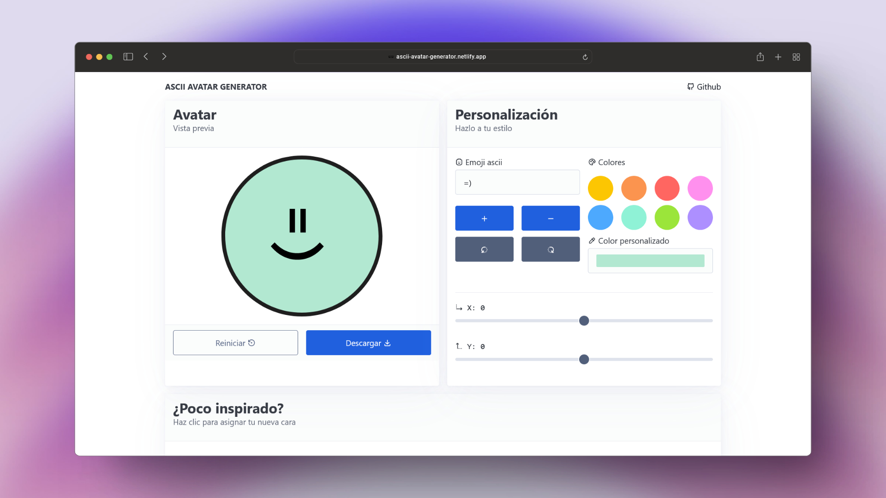

<h1>Generador de Avatares ASCII</h1>

Crea tus propios avatares con caracteres ASCII.

> [!NOTE]
> Me he inspirado en el creador de personajes del videojuego [*Content
Warning*](https://store.steampowered.com/app/2881650/Content_Warning/).
> 

## Características

- Interfaz sencilla e intuitiva.
- Controles para una mejor personalización.
- Exportación a png.

## Instalación para desarrollo

1. Clonar el repositorio
2. Abir visual studio code
3. `npm install` o `pnpm install`

## Licencia

Este proyecto está bajo la licencia MIT.